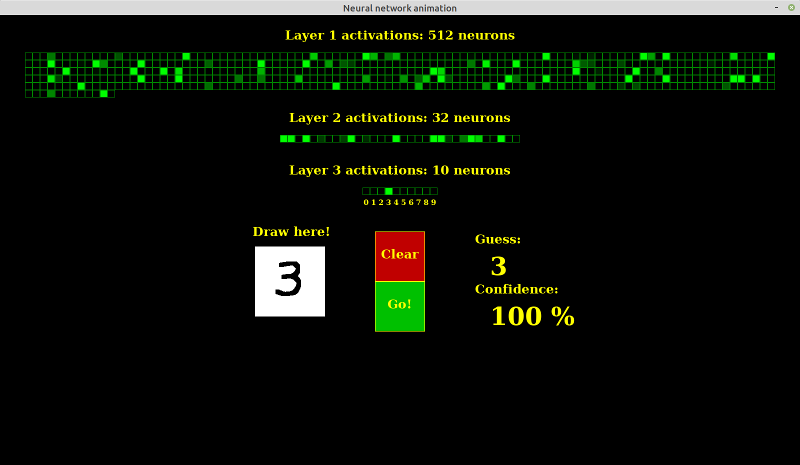

# MNIST animation




Try the animation by running the command below:

```
./animation.exe
```

An optional argument ``` 1 ``` can be passed, in order to enable the recognition of mirrored digits.


The program will try to recognize user drawn digits. It does not work especially well, since such inputs do not match the pixel distribution of samples from the MNIST dataset. To improve on this, a new dataset created from user drawn digits should be made, in order to either retrain a network from scratch on it, or instead try to make user inputs distribution closer from dataset ones, by optimizing the preprocessing phase, along with some parameters such as line thickness, or input grayscale levels.
